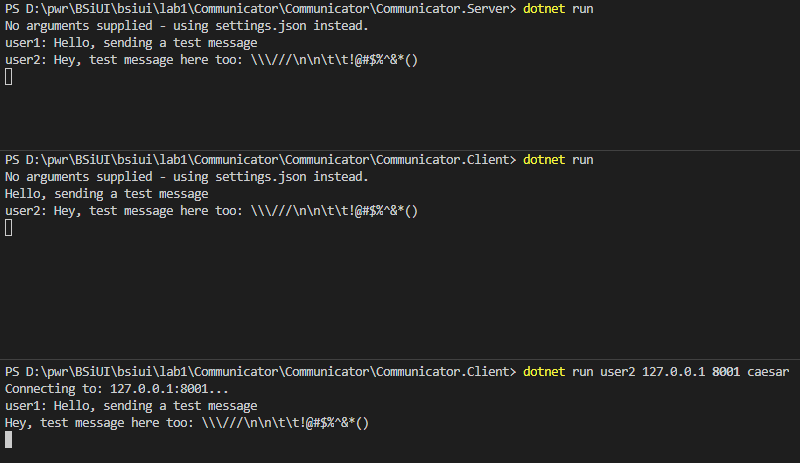
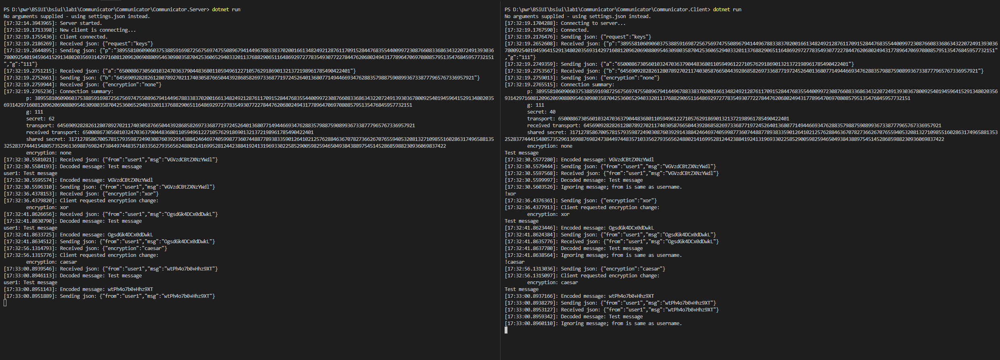

# Laboratorium 1
## Opis projektu
Celem projektu było stworzenie prostego komunikatora korzystającego z protokołu Diffiegio-Heimana.
* Projekt
  * Multiplatformowy — technologia .NET Core 2.1
  * Wspiera szyfrowanie xor oraz szyfr cezara
  * Konfigurowalny (za pomocą argumentów lub pliku settings.json)
  * Wspiera logowanie zdarzeń do konsoli
* Klient
  * Umożliwia zmianę szyfrowania w locie
* Serwer 
  * Obługuje wielu klientów
  * Każdy klient może mieć inne parametry DH oraz typ szyfrowania  

## Wymagania systemowe
* .NET Core >= 2.1.4 SDK
* .NET Core >= 2.1.4 Runtime
## Uruchamianie
### Serwer
1. Należy przejść do folderu Communicator.Server
2. Uruchomić klienta za pomocą polecenia *dotnet run*
  * Serwer pobierze wartości konfiguracji z pliku *settings.json* w przypadku uruchomienia bez argumentów
  * Uruchamianie z argumentami: **dotnet run *{port}***. Jako dodatkowy argument można podać logowanie do konsoli (***logging***)
  
### Klient
1. **Serwer musi być uruchomiony**
2. Należy przejść do folderu Communicator.Client
3. Uruchomić klienta za pomocą polecenia *dotnet run*
  * Klient pobierze wartości konfiguracji z pliku *settings.json* w przypadku uruchomienia bez argumentów
  * Uruchamianie z argumentami: **dotnet run *{nazwa użytkownika} {adres serwera} {port}***. Jako dodatkowe argumenty można podać szyfrowanie (***none/xor/caesar***) lub logowanie do konsoli (***logging***)
  
#### Zmiana szyfrowania
Szyfrowanie może zostać zmienione przy użyciu jednego z trzech poleceń:
* !none
* !xor
* !caesar

**Konfiguracja poprzez plik *settings.json* umożliwia zmianę większej ilości parametrów, np. rozmiar bufora.**
Połączenie może zostać zakończone przez przerwanie (Ctrl + C).

### Przykłady
#### Komunikacja między dwoma klientami, serwer i pierwszy klient konfigurowane przez *settings.json*, drugi klient konfigurowany argumentami

#### Klient i serwer konfigurowane przez *settings.json*, logowanie włączone, zmiana szyfrowania w locie

## Implementacja
### Architektura
Projekt jest podzielony na cztery cześci:
1. [Communicator.Client](Communicator/Communicator.Client) - aplikacja konsolowa klienta, logika komunikacji specyficzna dla klienta
2. [Communicator.Server](Communicator/Communicator.Server) - aplikacja konsolowa serwera, logika komunikacji specyficzna dla serwera
3. [Communicator.Common](Communicator/Communicator.Common) - biblioteka zawierająca abstrakcyjne klasy służace do komunikacji oraz klasy związane z szyfrowaniem
4. [Communicator.Tests](Communicator/Communicator.Tests) - testy jednostkowe (XUnit) sprawdzające poprawność szyfrowania oraz wymiany/generacji kluczy DH

